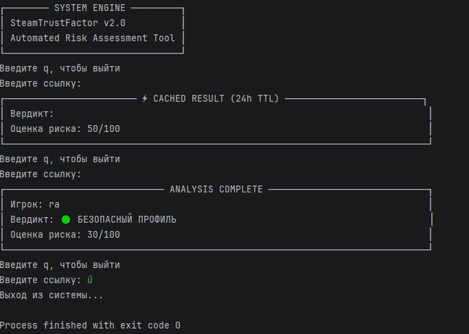

# 🛡️ SteamTrustFactor (Steam Scam Checker)

Консольная утилита на Python для автоматизированного анализа и оценки рисков мошенничества (scam-scoring) профилей Steam.

Проект использует **Steam Web API** для сбора данных об аккаунте, парсит параметры безопасности, историю банов и список друзей, после чего рассчитывает совокупный индекс риска.



---

## 🚀 Основные возможности

- **Автоматический резолвинг ссылок:** Работает как с прямыми `SteamID64`, так и с кастомными URL (`vanity URL`).
- **Анализ профиля:** Проверка приватности, возраста аккаунта и наличия VAC/Game банов.
- **Чекер друзей и игр:** Оценка социальной активности и количества купленных игр.
- **Парсинг никнейма на триггеры:** Мгновенная проверка имени пользователя по базе скам-слов с использованием `set` ($O(1)$ сложность поиска).
- **Покрытие автотестами:** Критическая бизнес-логика расчёта рисков покрыта unit-тестами на `pytest`.

---

## 🛠️ Технологический стек

- **Python 3.10+** (Type Hinting, Async-ready)
- **Requests** — работа с внешними REST API
- **Pytest** — автоматическое тестирование
- **Python-dotenv** — безопасное управление API-ключами и конфигурацией
- **Git** — контроль версий

---

## 🔧 Инструкция по установке и запуску

1. **Клонируйте репозиторий:**
   ```bash
   git clone https://github.com/Vladimir2524/SteamTrustFactor.git
   cd SteamTrustFactor

2. **Создайте и активируйте виртуальное окружение:**
    python -m venv .venv
3. 
    # Для Windows:
    .venv\Scripts\activate


3. **Установите зависимости:**
    pip install -r requirements.txt


4. **Настройте переменные окружения:**
   Создайте файл .env в корне проекта и добавьте ваш Steam API Key:

    STEAM_API_KEY=ваш_ключ_здесь

(Получить ключ можно на официальном сайте: https://steamcommunity.com/dev/apikey)


5. Запустите программу:
    python logic.py

6. Запуск автотестов:


    pytest -v
